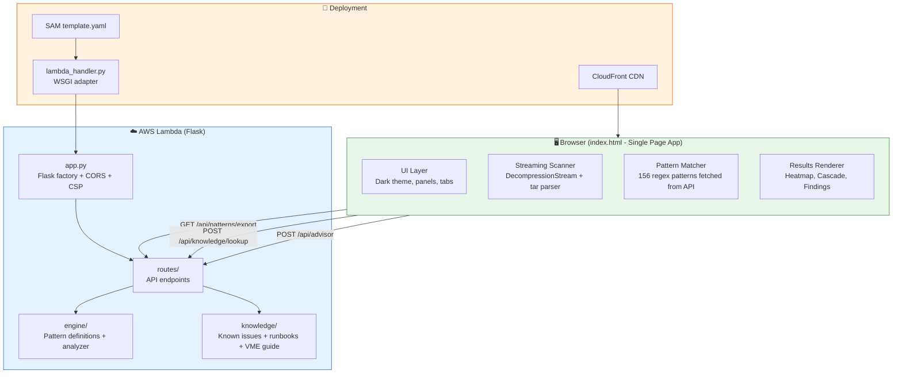

# 🛠️ Contributing to LogSherlock Pro

Quick guide for developers joining the project.

---

## 🏗️ Architecture Overview



---

## 📂 File Map — What Does What

### Frontend (Single File)

| File | Purpose | Key Functions |
|------|---------|---------------|
| `templates/index.html` | **The entire frontend** — 275KB single-page app | `scanLocally()`, `streamTarEntries()`, `handleFiles()`, `renderFindingsList()`, `generateCommentReply()`, `showLineActions()` |

> **Why one file?** Deployed via CloudFront as a static asset served from Lambda. No build step, no bundler. Everything inline for zero-dependency deployment.

### Backend (Flask)

| File | Purpose |
|------|---------|
| `app.py` | Flask app factory, route registration, CORS, CSP headers, auth middleware |
| `config.py` | Environment detection (local/lambda/docker), DB config |
| `models.py` | SQLAlchemy models — Ticket, Finding, Pattern (used in local mode) |
| `storage.py` | Abstract storage layer (local SQLite / DynamoDB) |
| `db_dynamo.py` | DynamoDB adapter for serverless mode |

### Engine (Pattern Detection)

| File | Purpose |
|------|---------|
| `engine/patterns.py` | **156 regex patterns** — `BUILT_IN_PATTERNS` list, each with: `name`, `regex`, `severity`, `category`, `description`, `solution_hint` |
| `engine/analyzer.py` | Server-side analysis orchestrator (not used in browser mode) |
| `engine/ingestion.py` | File parsing — tar extraction, line splitting, file classification |
| `engine/correlator.py` | Cross-node timeline correlation for multi-host analysis |

### Knowledge Base

| File | Purpose | Count |
|------|---------|-------|
| `knowledge/known_issues.py` | `KNOWN_ISSUES` list — pattern → root cause + solution | 73 issues |
| `knowledge/runbooks.py` | `RUNBOOKS` list — step-by-step investigation guides | 12 runbooks |
| `knowledge/vme_guide.py` | `VME_GUIDE` list — VME operations quick reference | 41 entries |
| `knowledge/advanced_troubleshooting.py` | Advanced troubleshooting procedures | Extended KB |
| `knowledge/similar_tickets.py` | Historical ticket patterns for matching | Reference data |
| `knowledge/kb_manager.py` | CRUD operations for knowledge base entries | Utility |

### Routes (API Endpoints)

| File | Endpoints | Purpose |
|------|-----------|---------|
| `routes/analysis.py` | `/api/patterns/export`, `/api/advisor`, `/api/analyze` | Pattern delivery + ticket advisor |
| `routes/knowledge.py` | `/api/knowledge/lookup`, `/api/knowledge/issues`, `/api/knowledge/vme-guide` | KB matching |
| `routes/analytics.py` | `/api/analytics` | Usage tracking (admin-only) |
| `routes/tickets.py` | `/api/tickets/*` | Ticket CRUD (local mode) |
| `routes/reports.py` | `/api/reports/*` | Report generation |
| `routes/feedback.py` | `/api/feedback/*` | User feedback |
| `routes/logs.py` | `/api/logs/*` | Log file management (local mode) |
| `routes/ui.py` | `/` , `/dashboard` | HTML page serving (local mode) |

### Deployment

| File | Purpose |
|------|---------|
| `deploy/template.yaml` | **SAM/CloudFormation** — defines Lambda, API Gateway, DynamoDB, CloudFront |
| `deploy/lambda_handler.py` | Custom WSGI adapter — converts Lambda events to Flask requests |
| `deploy/deploy.ps1` | Windows deployment script (7 steps: build → deploy → invalidate) |
| `deploy/deploy.sh` | Linux/Mac deployment script |
| `deploy/samconfig.toml` | SAM CLI config (stack name, region, capabilities) |
| `deploy/requirements.txt` | Lambda-specific Python deps |

### Tests

| File | Purpose |
|------|---------|
| `tests/test_basic.py` | Core unit tests — pattern matching, KB lookup |
| `tests/test_analyze.py` | Analysis endpoint tests |
| `tests/test_advisor.py` | Ticket advisor tests |
| `tests/e2e_test.py` | End-to-end flow tests |
| `tests/perf_test.py` | Performance benchmarks |
| `tests/benchmark.py` | Detailed timing benchmarks |
| `tests/sanity_check.py` | Quick health check for deployed API |

---

## 🔑 Key Concepts

### How Browser Scanning Works

```
User drops tar.gz
    → file.stream() creates ReadableStream
    → .pipeThrough(new DecompressionStream('gzip'))  [native browser API]
    → streamTarEntries() async generator:
        - Reads 512-byte tar headers
        - Extracts filename, size, mtime
        - Reads file content
        - Yields {name, size, content, mtime}
        - Content is scanned line-by-line against 156 patterns
        - Findings stored, content DISCARDED (flat memory)
    → Results rendered to DOM
    → Pattern names sent to /api/knowledge/lookup for KB matches
```

### How Patterns Are Structured

```python
# In engine/patterns.py
{
    "name": "kernel_panic",           # Unique identifier
    "regex": r"Kernel panic - not syncing",  # Python regex
    "severity": "CRITICAL",           # CRITICAL / HIGH / MEDIUM / LOW
    "category": "kernel",             # 12 categories
    "description": "Kernel panic detected...",
    "solution_hint": "Check dmesg, look for OOM or hardware errors..."
}
```

### How Knowledge Lookup Works

```
Browser sends: POST /api/knowledge/lookup
Body: {"patterns": ["kernel_panic", "oom_kill", "gfs2_withdraw"]}

Server matches pattern names against:
  - known_issues.py → returns issue description + solution
  - runbooks.py → returns relevant investigation steps
  - vme_guide.py → returns operational guidance

Response: {known_issues: [...], runbooks: [...], vme_guide: [...]}
```

---

## 🚀 Quick Start for Development

### Local (Flask server)
```bash
pip install -r requirements.txt
python app.py
# → http://localhost:5000
```

### Deploy to AWS
```powershell
cd deploy/
sam build --template-file template.yaml
sam deploy --no-confirm-changeset
aws cloudfront create-invalidation --distribution-id E3V2MZ00F7WXY9 --paths "/*"
```

### Run Tests
```bash
pytest tests/ -v
python tests/sanity_check.py  # Quick health check against live API
```

---

## 📏 Code Style

- **Frontend**: Vanilla JS, no framework, no build step. All in `index.html`.
- **Backend**: Flask, Python 3.11. Standard PEP 8.
- **Naming**: snake_case for Python, camelCase for JavaScript.
- **Patterns**: Always include `name`, `regex`, `severity`, `category`, `description`, `solution_hint`.
- **Knowledge entries**: Always include `pattern_name`, `title`, `description`, `solution`, `commands`.

---

## ⚠️ Important Rules

1. **ZERO customer data upload** — The frontend NEVER sends raw log content to any server. Only pattern names.
2. **AI is LOCAL ONLY** — Ollama on localhost. No OpenAI, no Claude, no cloud AI APIs. Ever.
3. **All times in IST** — Display `Asia/Kolkata` timezone with "IST" suffix.
4. **Single HTML file** — Don't split `index.html` into components. It deploys as-is.
5. **No external JS CDNs** — pako.js is the only external lib (loaded from CDN for gzip fallback).

---

## 📊 Adding a New Pattern

1. Add to `engine/patterns.py` → `BUILT_IN_PATTERNS` list
2. Add matching known issue to `knowledge/known_issues.py` → `KNOWN_ISSUES` list
3. Test: `curl -X POST .../api/knowledge/lookup -d '{"patterns":["your_pattern_name"]}'`
4. Deploy: `sam build && sam deploy`

## 💡 Adding a New Feature

1. Frontend changes → `templates/index.html`
2. Backend changes → add route in `routes/` + register in `app.py`
3. Test locally → `python app.py`
4. Deploy → `deploy/deploy.ps1` (or `deploy.sh`)
5. Invalidate → CloudFront cache takes ~60s to clear
