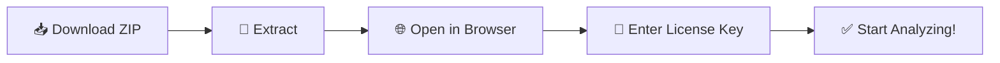
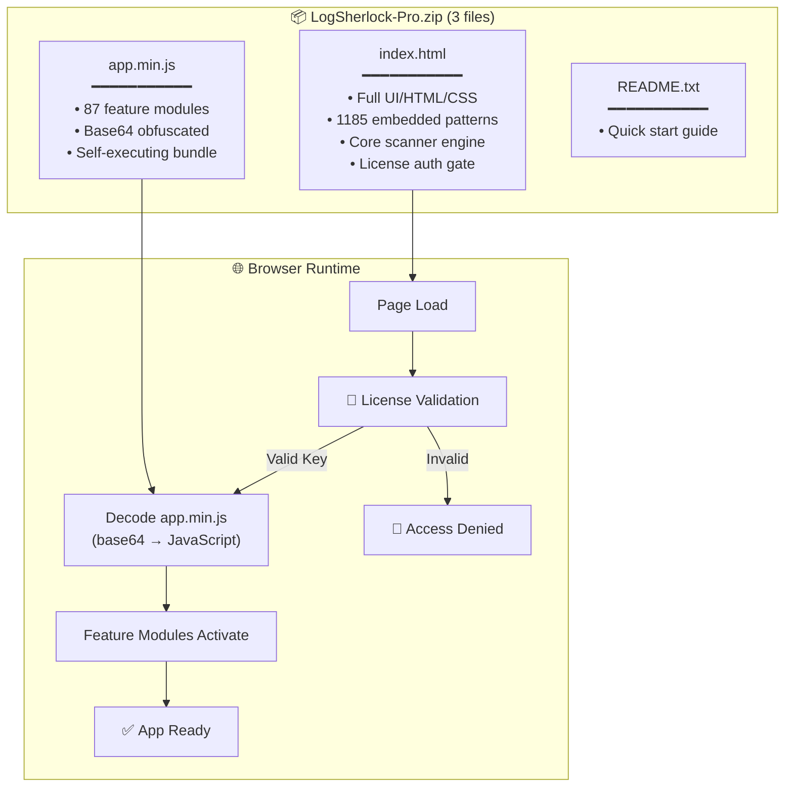
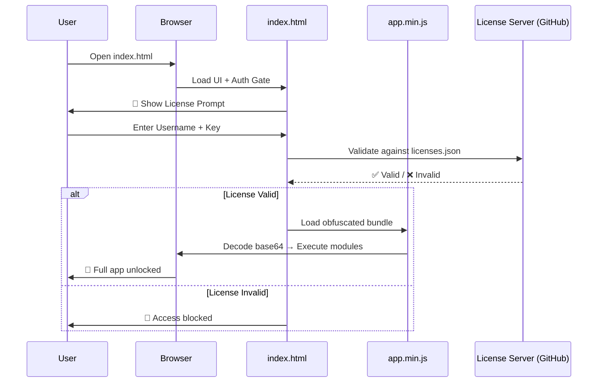
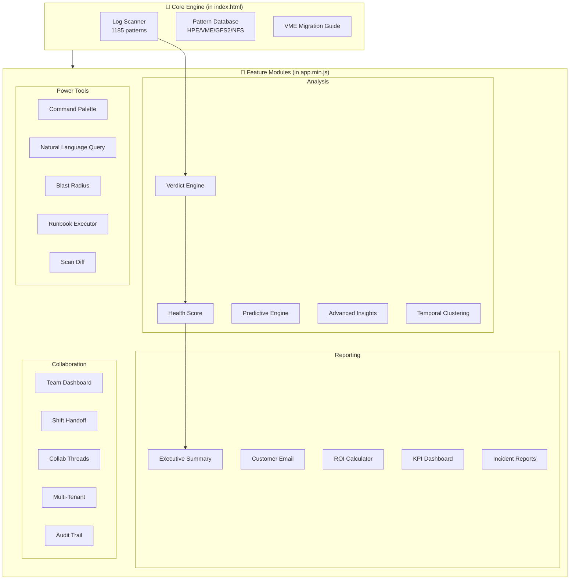
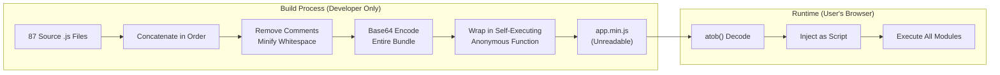

# 🔍 LogSherlock Pro — Offline Bundle

> **Enterprise-grade HPE VMware log analysis tool that runs 100% offline in your browser.**  
> No server. No cloud. No data leaves your machine.

---

## 📦 What's Inside

```
LogSherlock-Pro.zip
├── index.html      ← The full application (open in browser)
├── app.min.js      ← Obfuscated engine (87+ modules bundled)
└── README.txt      ← Quick start instructions
```

---

## 🚀 How to Run (3 Steps)



### Option 1: Direct Open
1. Extract the ZIP
2. Double-click `index.html`
3. Enter your license key → Done!

### Option 2: Local Server (Recommended for large logs)
```bash
cd LogSherlock-Pro
python -m http.server 8888
# Open http://localhost:8888
```

---

## 🏗️ Architecture — How the Offline Bundle Works



---

## 🔐 Security & License Flow



---

## ⚙️ Module Architecture



---

## 🔒 Code Protection



**What developers see if they try to read the code:**
```javascript
(function(){var _0x=["TG9nU2hlcmxvY2sgUHJvI...3 million chars...YWxs"];
var _s=atob(_0x[0]);var _e=document.createElement('script');
_e.textContent=_s;document.head.appendChild(_e);})();
```
> ❌ No function names visible  
> ❌ No variable names readable  
> ❌ No business logic exposed  
> ❌ Cannot simply copy individual features  

---

## 📊 Feature List (87 Modules)

| Category | Modules |
|----------|---------|
| 🔍 **Analysis** | Verdict Engine, Health Score, Predictive Engine, Advanced Insights, Temporal Clustering, Anomaly Heatmap, Root Cause Chain, Failure Fingerprint |
| 📋 **Reporting** | Executive Summary, Customer Email Generator, ROI Calculator, KPI Dashboard, Incident Report Generator, Compliance Export |
| 🤝 **Collaboration** | Team Dashboard, Shift Handoff, Collab Threads, Multi-Tenant, Audit Trail, Finding Comments |
| 🛠️ **Tools** | Command Palette, Natural Language Query, Blast Radius, Runbook Executor, Scan Diff, Log Diff Analyzer, Smart Search |
| 🎯 **HPE Patterns** | VME Migration, GFS2 Deep, NFS Deep, Alletra Deep, Cluster Patterns, Lifecycle, Confirmed Patterns |
| 📈 **Intelligence** | Predictive Alerts, Trend Over Time, Baseline Subtraction, Noise Suppression, Alert Fatigue Scorer, Pattern Confidence |
| 🎨 **UX** | Live Demo Mode, Guided Mode, Training Mode, Onboarding Flow, Custom Themes, Split View, Bookmark Manager |

---

## 🖥️ System Requirements

| Requirement | Minimum |
|-------------|---------|
| Browser | Chrome 90+, Firefox 88+, Edge 90+, Safari 14+ |
| RAM | 4 GB (8 GB recommended for large logs) |
| Disk | 50 MB free space |
| Network | **Not required** (offline-first) |
| Server | None — runs entirely in browser |

---

## 🔑 License Types

| Type | Format | Use Case |
|------|--------|----------|
| Standard | `LS-XXXX-XXXX-XXXX-XXXX` | Individual user |
| Master | `LS-MASTER-XXXX-XXXX` | Enterprise / Admin |

> License validates once online, then works offline for the session.

---

## ❓ FAQ

**Q: Does my log data go to any server?**  
A: No. Everything runs locally in your browser. Zero data transmitted.

**Q: Can I use it without internet?**  
A: Yes! After initial license activation, the app works fully offline.

**Q: Why only 3 files?**  
A: We bundle 87+ modules into one obfuscated file for simplicity and IP protection.

**Q: Can I host this on my internal network?**  
A: Yes! Just put the 3 files on any HTTP server (Apache, Nginx, IIS, Python).

---

## 📞 Support

- **Developer:** Krishna Yada
- **Issues:** [GitHub Issues](https://github.com/yadakrishna245/Log_analysis/issues)
- **License:** Proprietary — All Rights Reserved © 2026

---

<p align="center">
  <b>LogSherlock Pro v4.0</b> — Enterprise Log Intelligence, Zero Cloud Dependency
</p>
