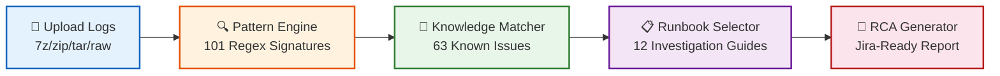
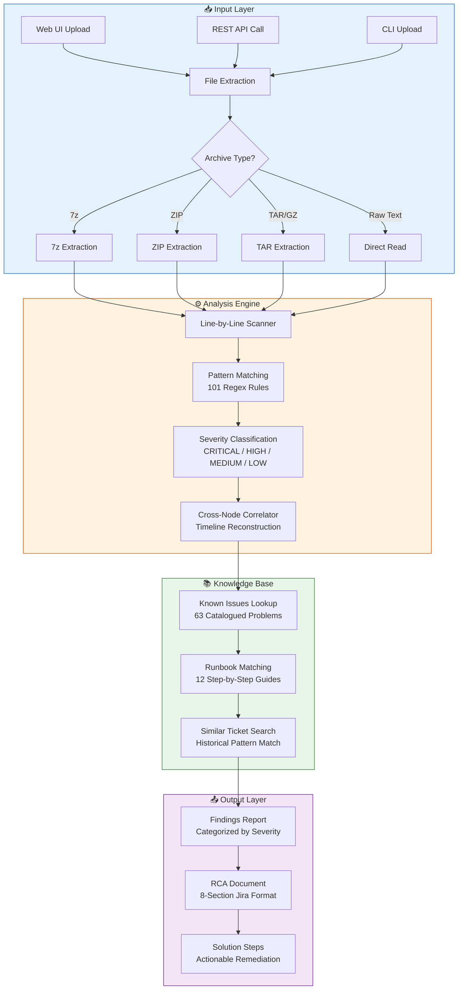
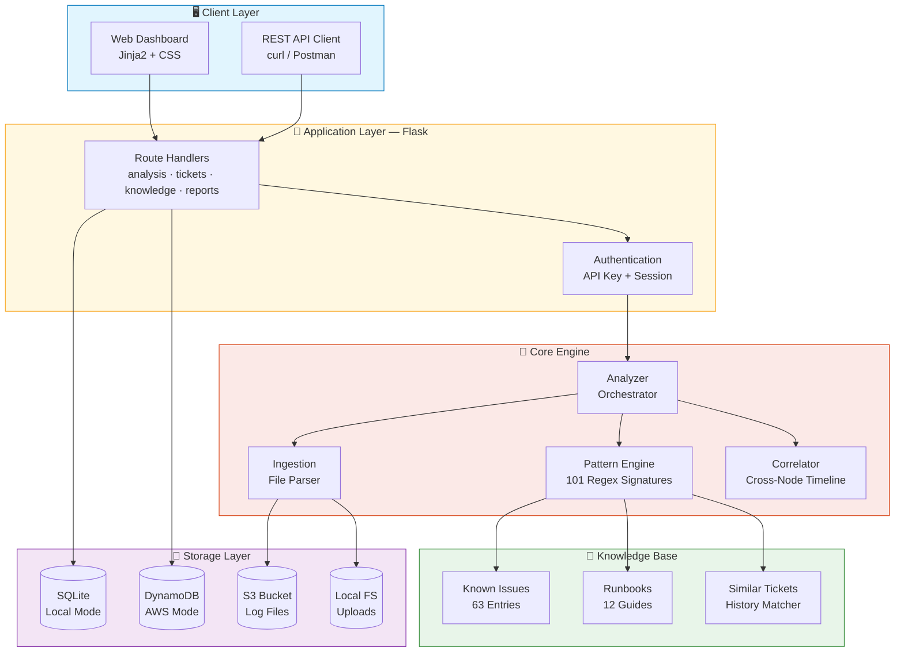
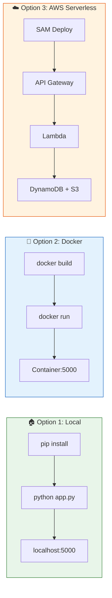
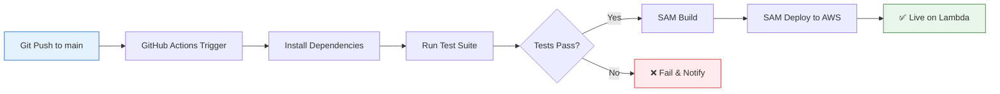
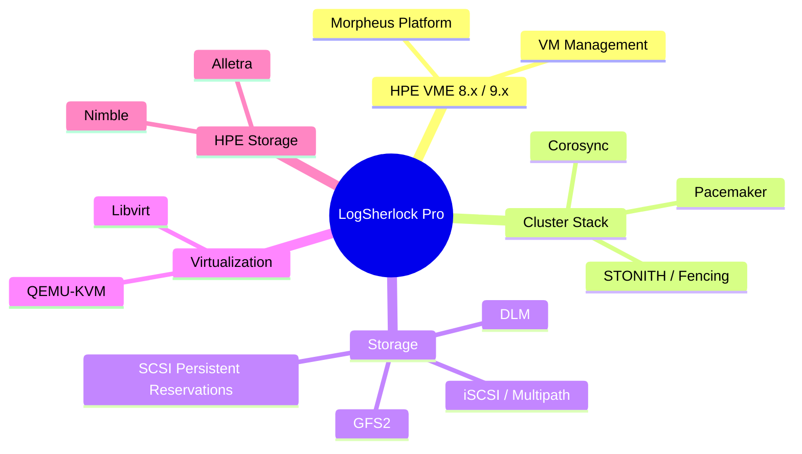
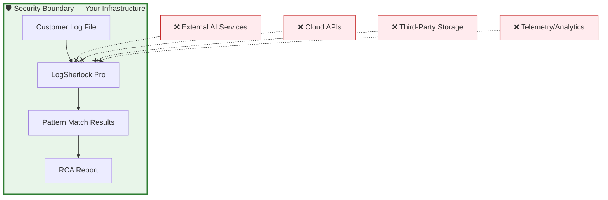
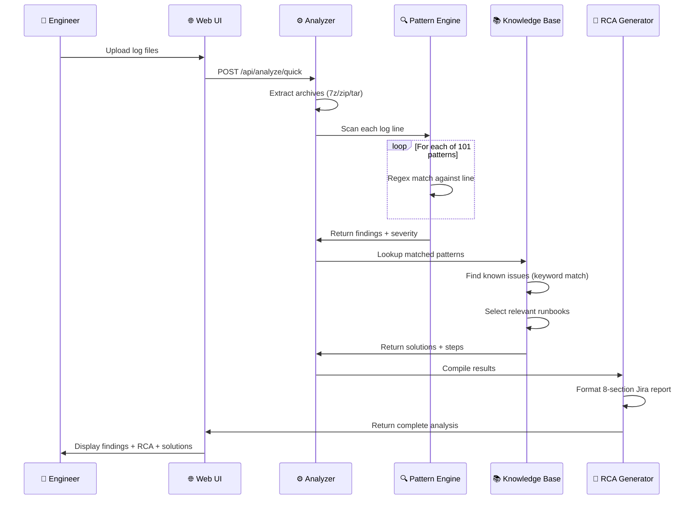
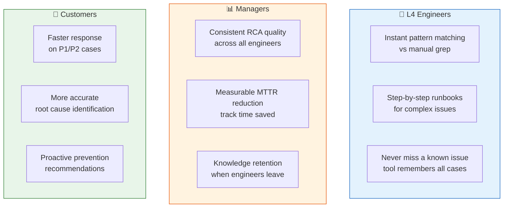

<div align="center">

# 🔍 LogSherlock Pro

### Intelligent Log Analysis for HPE VME Support Engineering

[](https://python.org)
[](https://flask.palletsprojects.com)
[](https://aws.amazon.com)
[](https://docker.com)
[](LICENSE)

**Turn hours of manual log investigation into minutes.**  
Upload customer logs → Get instant root cause analysis with actionable solutions.

[Getting Started](#-getting-started) • [Architecture](#-architecture) • [API Docs](#-api-endpoints) • [Deployment](#-deployment-options) • [Security](#-security--compliance)

---

</div>

## 📊 Impact at a Glance

<table>
<tr>
<td width="50%">

### ❌ Without LogSherlock
- 2-4 hours manually grepping through logs
- Tribal knowledge locked in senior engineers' heads
- Missed correlations across multi-node clusters
- Inconsistent RCA reports across the team
- No log tools approved for on-prem use

</td>
<td width="50%">

### ✅ With LogSherlock
- **< 2 minutes** automated analysis
- **101 detection patterns** available to all engineers
- **Automatic cross-node timeline** reconstruction
- **One-click Jira-ready RCA** in standard format
- **100% on-premises** — zero data leaves the network

</td>
</tr>
</table>

---

## 🧠 How It Works

> **"Is this AI? Will it hallucinate?"**  
> **NO.** Pure regex pattern matching + structured knowledge lookup. Zero AI. Zero hallucination. Fully deterministic.



### Analysis Pipeline — Detailed Flow



---

## 🏗️ Architecture



---

## 🚀 Deployment Options



### Option 1: Local (On-Premises)

```bash
# Install & run in 30 seconds
git clone https://github.com/yadakrishna245/Log_analysis.git
cd Log_analysis
pip install -r requirements.txt
flask init-db
python app.py
# → Open http://localhost:5000
```

### Option 2: Docker

```bash
docker build -t logsherlock-pro .
docker run -p 5000:5000 logsherlock-pro
```

### Option 3: AWS Serverless (Single-Click)

```bash
cd deploy
./deploy.sh          # Linux/Mac
.\deploy.ps1        # Windows
```

> **AWS Cost:** ~$1.50/month (DynamoDB + S3 + Lambda free tier)

---

## 🔄 CI/CD Pipeline



---

## 📈 Knowledge Base Statistics

<div align="center">

| 🎯 Metric | 📊 Count |
|:---------:|:--------:|
| Detection Patterns | **101** |
| Known Issues | **63** |
| Guided Runbooks | **12** |
| Products Covered | **7** |
| Log Formats Supported | **15+** |
| Severity Levels | **4** |

</div>

---

## 🎯 Supported Products & Components



---

## 🌐 API Endpoints

| Endpoint | Method | Description |
|:---------|:------:|:------------|
| `/api/health` | `GET` | Health check & status |
| `/api/analyze/quick` | `POST` | Upload & analyze files instantly |
| `/api/tickets` | `GET` `POST` | Manage support tickets |
| `/api/tickets/{id}/analyze` | `POST` | Run analysis on ticket logs |
| `/api/tickets/{id}/report` | `GET` | Generate RCA report |
| `/api/knowledge/search?q=` | `GET` | Search knowledge base |
| `/api/knowledge/issues` | `GET` | List all known issues |
| `/api/knowledge/runbooks` | `GET` | List all runbooks |
| `/api/stats` | `GET` | Dashboard statistics |

### Quick Example

```bash
# Upload & analyze
curl -X POST http://localhost:5000/api/analyze/quick \
  -F "files=@customer_logs.7z" \
  -F "description=GFS2 mount failures after node reboot"
```

<details>
<summary>📋 <strong>Response Example</strong> (click to expand)</summary>

```json
{
  "findings_count": 12,
  "findings": [
    {
      "pattern_name": "dlm_quorum_lost",
      "severity": "CRITICAL",
      "description": "DLM lost quorum - GFS2 mounts will fail",
      "solution_hint": "Check corosync membership, verify network connectivity"
    }
  ],
  "related_issues": [
    {
      "title": "GFS2 mount failure due to DLM quorum loss after node reboot",
      "solution": "Restart corosync, verify all nodes rejoin cluster"
    }
  ],
  "suggested_runbook": "gfs2_mount_failure_investigation",
  "jira_report": "h2. Root Cause Analysis (RCA)\n..."
}
```

</details>

---

## 🔒 Security & Compliance



### Data Privacy Guarantees

| Concern | How We Address It |
|:--------|:------------------|
| **Data residency** | 100% on-premises OR your own private AWS account |
| **No external AI calls** | Zero calls to OpenAI, Google, or any third-party AI |
| **No telemetry** | No usage tracking, no analytics, no phone-home |
| **No internet required** | Works fully offline — air-gapped capable |
| **Customer data isolation** | Single-tenant. No shared databases |
| **Log retention** | Auto-deleted after 7 days (configurable) |
| **Source code clean** | Zero customer names, IPs, or ticket IDs in codebase |

### Security Controls

| Control | Implementation |
|:--------|:---------------|
| Authentication | API key (`X-API-Key`) + session-based login |
| Authorization | All `/api/*` endpoints require valid credentials |
| Encryption at rest | S3 AES-256, DynamoDB encryption by default |
| Encryption in transit | HTTPS/TLS via API Gateway or reverse proxy |
| Input validation | `secure_filename()`, zip-slip prevention |
| Security headers | CSP, X-Frame-Options, X-Content-Type-Options |
| Rate limiting | Configurable request throttling |
| File size limits | Configurable (default 4GB) |

### Compliance Alignment

| Standard | Relevant Controls |
|:---------|:------------------|
| **SOC 2** | Encryption at rest & transit, access controls, audit logging |
| **GDPR** | No personal data processed, data retention policies |
| **ISO 27001** | Access management, cryptographic controls |
| **HPE Internal** | No customer data in code, single-tenant, no external APIs |

<details>
<summary>📝 <strong>Copy-Paste Statement for Compliance Review</strong></summary>

> *"LogSherlock Pro performs pattern matching using pre-built regex signatures against uploaded log files. It does NOT use any AI/ML model, does NOT send data to any external service, and runs entirely within our own infrastructure (either on-premises or in our dedicated AWS account). Customer log data is never exposed to the internet, shared with third parties, or stored beyond the configured retention period."*

</details>

---

## 🧩 How the Pattern Engine Works



---

## 📂 Project Structure

```
LogSherlock-Pro/
│
├── 🐍 app.py                    # Flask application factory
├── ⚙️ config.py                  # Configuration management
├── 🗃️ models.py                  # Database models (SQLAlchemy)
├── 💾 storage.py                 # Storage abstraction (SQLite ↔ DynamoDB)
├── ☁️ db_dynamo.py               # DynamoDB data layer
├── 📦 requirements.txt           # Python dependencies
├── 🐳 Dockerfile                 # Container deployment
│
├── engine/                       # 🔬 Core Analysis Engine
│   ├── patterns.py               #    101 detection patterns (regex)
│   ├── analyzer.py               #    Analysis orchestrator
│   ├── ingestion.py              #    File parsing & extraction
│   └── correlator.py             #    Cross-node correlation
│
├── knowledge/                    # 📖 Knowledge Base
│   ├── known_issues.py           #    63 catalogued known issues
│   ├── runbooks.py               #    12 investigation runbooks
│   ├── similar_tickets.py        #    Similar ticket matching
│   └── kb_manager.py             #    Knowledge base CRUD manager
│
├── routes/                       # 🌐 API Endpoints
│   ├── analysis.py               #    Upload & analyze
│   ├── tickets.py                #    Ticket CRUD + RCA generation
│   ├── knowledge.py              #    KB search & browse
│   ├── reports.py                #    Report generation & export
│   ├── logs.py                   #    Log file management
│   └── ui.py                     #    Web UI page routes
│
├── services/                     # 🛠️ Business Services
│   └── pattern_seeder.py         #    Database seeding utilities
│
├── deploy/                       # ☁️ AWS Serverless Deployment
│   ├── template.yaml             #    SAM/CloudFormation template
│   ├── lambda_handler.py         #    Lambda entry point
│   ├── deploy.ps1                #    One-click deploy (Windows)
│   ├── deploy.sh                 #    One-click deploy (Linux/Mac)
│   └── samconfig.toml            #    SAM CLI configuration
│
├── docs/                         # 📚 Documentation
│   ├── DEPLOYMENT.md             #    Deployment guide
│   ├── USER_GUIDE.md             #    User guide
│   ├── COMPLIANCE.md             #    Security & compliance
│   └── SALES_PITCH.md            #    Business value summary
│
├── templates/                    # 🎨 Web UI (Jinja2 HTML)
├── static/                       # 🎨 CSS/JS assets
├── tests/                        # ✅ Test suite + sample logs
└── .github/workflows/            # 🔄 CI/CD automation
```

---

## 👥 Who Benefits



---

## ⚡ Getting Started

### Prerequisites

- Python 3.10+
- (Optional) AWS CLI + SAM CLI for cloud deployment
- (Optional) Docker for containerized deployment

### Quick Start

```bash
# 1. Clone
git clone https://github.com/yadakrishna245/Log_analysis.git
cd Log_analysis

# 2. Install dependencies
pip install -r requirements.txt

# 3. Initialize database
flask init-db

# 4. Run
python app.py
```

> 🌐 Open **http://localhost:5000** in your browser

### Environment Variables

| Variable | Default | Description |
|:---------|:--------|:------------|
| `SECRET_KEY` | auto-generated | Flask session secret |
| `STORAGE_BACKEND` | `sqlite` | `sqlite` or `dynamodb` |
| `LOGSHERLOCK_API_KEY` | — | API authentication key |
| `LOGSHERLOCK_DEV_MODE` | `false` | Skip auth in development |
| `UPLOAD_FOLDER` | `./uploads` | File upload directory |
| `S3_BUCKET` | — | S3 bucket (AWS mode) |
| `DYNAMODB_TABLE_PREFIX` | `LogSherlock` | DynamoDB table prefix |

---

## 🧪 Testing

```bash
# Run full test suite
pytest tests/ -v

# Run with coverage
pytest tests/ --cov=engine --cov=knowledge --cov=routes
```

---

## 📊 Technology Comparison

| Aspect | LogSherlock Pro | AI/LLM Tools | Manual Grep |
|:-------|:---------------:|:------------:|:-----------:|
| Speed | ⚡ < 2 min | ⚡ < 1 min | 🐌 2-4 hours |
| Accuracy | ✅ 100% deterministic | ⚠️ Can hallucinate | ✅ Depends on skill |
| Compliance | ✅ On-prem, no data leaks | ❌ Sends data to cloud | ✅ Local |
| Consistency | ✅ Same output every time | ⚠️ Varies per query | ❌ Varies per engineer |
| Knowledge | ✅ 63 issues + 12 runbooks | ⚠️ Generic knowledge | ❌ Tribal knowledge |
| Audit trail | ✅ Full traceability | ❌ Black box | ❌ None |

---

## 🗺️ Roadmap

- [x] 101 detection patterns for VME/GFS2/DLM/Corosync/Pacemaker
- [x] 63 known issues with root cause + solution
- [x] 12 guided investigation runbooks
- [x] AWS serverless deployment (Lambda + DynamoDB + S3)
- [x] Docker containerization
- [x] CI/CD pipeline with GitHub Actions
- [x] Multi-format archive support (7z, ZIP, TAR, GZ)
- [x] Jira-ready RCA report generation
- [ ] Pattern contribution workflow (team can add new patterns)
- [ ] Grafana dashboard integration
- [ ] Slack/Teams notification on critical findings
- [ ] Bulk historical log re-analysis

---

## 📄 License

MIT License — Free for internal enterprise use.

---

<div align="center">

## 📬 Contact

**Maintainer:** Yada Krishna Chaithanya  
**Team:** HPE VME L4 Support Engineering  
**Repository:** [github.com/yadakrishna245/Log_analysis](https://github.com/yadakrishna245/Log_analysis)

---

*Built with ❤️ to make L4 support engineering faster and more reliable.*

<sub>LogSherlock Pro v1.0 • No AI • No Cloud Dependencies • 100% On-Premises Capable</sub>

</div>
