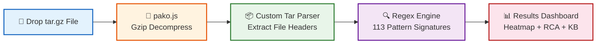
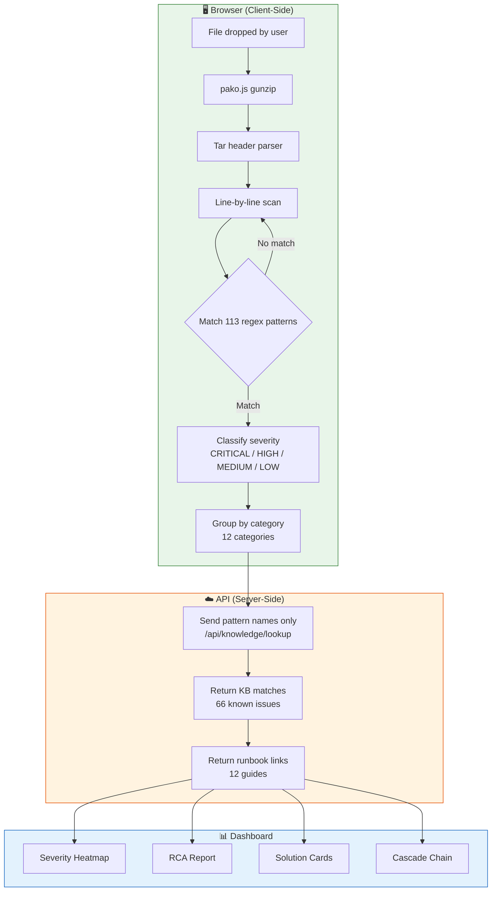
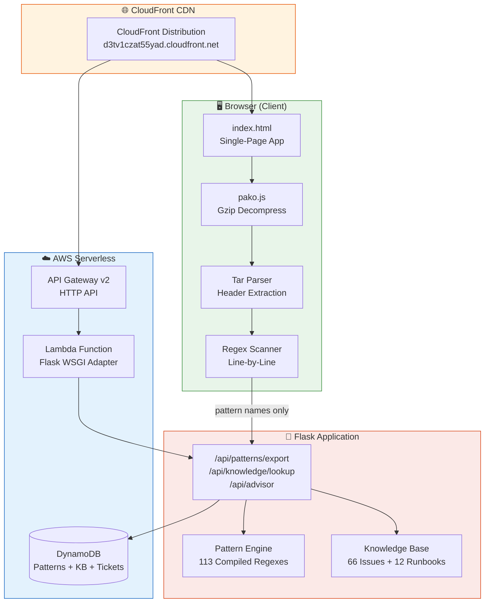

<div align="center">

# 🔍 LogSherlock Pro

### Intelligent Log Analysis for HPE VME Support Engineering

[](https://python.org)
[](https://flask.palletsprojects.com)
[](https://aws.amazon.com)
[](docs/USER_GUIDE.md)
[](docs/USER_GUIDE.md)
[](docs/USER_GUIDE.md)
[](#-security--privacy)

**Zero-upload log analysis — your data never leaves the browser.**  
Drop a tar.gz → Get instant root cause analysis with actionable solutions. 73MB in ~14 seconds.

### 🌐 [Live Demo → https://d3tv1czat55yad.cloudfront.net](https://d3tv1czat55yad.cloudfront.net)

[How to Demo](#-how-to-demo) • [Features](#-features-23) • [Architecture](#-architecture) • [How It Works](#-how-it-works) • [Getting Started](#-getting-started) • [API](#-api-endpoints) • [Security](#-security--privacy) • [Project Structure](#-project-structure)

---

</div>

## 📊 Impact at a Glance

<table>
<tr>
<td width="50%">

### ❌ Without LogSherlock
- 2–4 hours manually grepping through logs
- Tribal knowledge locked in senior engineers' heads
- Missed correlations across multi-node clusters
- Inconsistent RCA reports across the team
- No log tools approved for on-prem use

</td>
<td width="50%">

### ✅ With LogSherlock Pro
- **~14 seconds** for 73MB tar.gz analysis
- **113 detection patterns** available to all engineers
- **66 known issues** with ready-made solutions
- **One-click Jira-ready RCA** in 8-section format
- **Zero data upload** — browser-side scanning only

</td>
</tr>
</table>

---

## 🎯 How to Demo

> **For managers & stakeholders:** Try it in under 60 seconds.

1. Open **[https://d3tv1czat55yad.cloudfront.net](https://d3tv1czat55yad.cloudfront.net)**
2. Download the demo file from the `demo/` folder:  
   `collect_demovmehost01_20260802_100000.tar.gz` (9.4 KB, synthetic data)
3. Drag & drop the file onto the upload zone
4. Watch: **110 of 113 patterns** trigger instantly — all in the browser
5. Explore: Heatmap, Cascade Chain, RCA Report, Knowledge Base matches

**No login. No setup. No data leaves your machine.**

---

## 🧠 How It Works

> **"Is this AI? Will it hallucinate?"**  
> **NO.** Pure regex pattern matching + structured knowledge lookup. Zero LLM. Zero hallucination. Fully deterministic.

### Client-Side Scanning Flow



**Key privacy guarantee:** The tar.gz file is decompressed and scanned entirely in the browser using `pako.js` and a custom JavaScript tar parser. **Zero customer log data is uploaded to any server.** Only anonymous pattern names (e.g., "kernel_panic", "oom_kill") are sent to the API for Knowledge Base matching.

### Pattern Engine Detail



---

## ✨ Features (23+)

### Core Analysis
| # | Feature | Description |
|---|---------|-------------|
| 1 | **Client-Side Scanning** | Zero upload — pako.js + custom tar parser runs entirely in browser |
| 2 | **113 Regex Patterns** | Across 12 categories: kernel, storage, cluster, network, memory, etc. |
| 3 | **8-Section RCA Report** | Problem Statement → Impact → Timeline → Root Cause → Cascade Chain → Fix → Remediation Plan → Prevention |
| 4 | **Jira Wiki Markup** | One-click copy of full RCA in Jira-ready format |
| 5 | **Ticket Advisor** | Paste a Jira description → get file/folder investigation suggestions |

### Visualizations
| # | Feature | Description |
|---|---------|-------------|
| 6 | **Severity Heatmap** | Clickable — filter findings by file |
| 7 | **Severity Donut Chart** | At-a-glance severity distribution |
| 8 | **Failure Cascade Chain** | Visual cause → effect chain across components |
| 9 | **Event Distribution Timeline** | Temporal view of when issues occurred |

### Investigation Tools
| # | Feature | Description |
|---|---------|-------------|
| 10 | **Real-Time Search/Filter** | Splunk-style instant filtering across findings |
| 11 | **Smart Pattern Grouping** | Datadog-style accordion — group by pattern name |
| 12 | **AI One-Liner Summary** | Auto-generated root cause sentence (no LLM) |
| 13 | **Expandable Solution Cards** | Copy-able remediation commands for each finding |

### UX & Export
| # | Feature | Description |
|---|---------|-------------|
| 14 | **Dark/Light Theme** | Toggle with persistent preference |
| 15 | **Scan History** | Last 5 scans stored locally — click to reload |
| 16 | **CSV Export** | Export findings to spreadsheet |
| 17 | **PDF Export** | Export full RCA report as PDF |
| 18 | **Keyboard Shortcuts** | Ctrl+Enter to scan, Escape to clear |
| 19 | **Pattern Stats Counter** | Live stats on landing page |

### Knowledge & Operations
| # | Feature | Description |
|---|---------|-------------|
| 20 | **Knowledge Base** | 66 catalogued known issues with solutions |
| 21 | **Runbooks** | 12 step-by-step investigation guides |
| 22 | **HPE Branding** | Green logo and consistent brand identity |
| 23 | **CloudFront CDN** | Zero-cold-start serverless deployment |

---

## 🏗️ Architecture



### Data Flow — What Goes Where

| Data | Where it lives | Uploaded to server? |
|------|---------------|---------------------|
| Customer log files (tar.gz) | Browser memory only | ❌ **Never** |
| Decompressed log content | Browser memory only | ❌ **Never** |
| Scan results / findings | Browser memory only | ❌ **Never** |
| Pattern names (e.g., "oom_kill") | Sent to `/api/knowledge/lookup` | ✅ Anonymous identifiers only |
| Jira description text | Sent to `/api/advisor` | ✅ For investigation suggestions |
| 113 pattern definitions | Fetched from `/api/patterns/export` | N/A (server → client) |

---

## 📊 Feature Comparison

| Capability | LogSherlock Pro | Splunk | Datadog | Manual grep |
|-----------|:-:|:-:|:-:|:-:|
| Zero data upload | ✅ | ❌ | ❌ | ✅ |
| Auto pattern detection | ✅ 113 patterns | ✅ Custom | ✅ Custom | ❌ Manual |
| RCA report generation | ✅ 8-section | ❌ | ❌ | ❌ |
| Knowledge Base | ✅ 66 issues | ❌ | ❌ | ❌ |
| Setup time | 0 min (browser) | Days | Days | 0 min |
| Cost | Free | $$$$$ | $$$$ | Free |
| Works offline | ✅ (after load) | ❌ | ❌ | ✅ |
| Jira integration | ✅ One-click | Plugin | Plugin | ❌ |
| Severity heatmap | ✅ | ✅ | ✅ | ❌ |
| Cascade analysis | ✅ | ❌ | ❌ | ❌ |

---

## 🚀 Getting Started

### Option 1: Use the Live Demo (Recommended)

No setup required:
```
https://d3tv1czat55yad.cloudfront.net
```

### Option 2: Local Development

```bash
git clone https://github.com/yadakrishna245/Log_analysis.git
cd Log_analysis
pip install -r requirements.txt
python app.py
# → http://localhost:5000
```

### Option 3: AWS Serverless Deployment

```bash
cd deploy/
sam build
sam deploy --guided
# → CloudFront URL in outputs
```

See [docs/DEPLOYMENT.md](docs/DEPLOYMENT.md) for full deployment guide.

---

## 📡 API Endpoints

| Method | Endpoint | Description | Privacy |
|--------|----------|-------------|---------|
| `GET` | `/api/patterns/export` | Fetch all 113 patterns as JSON | No user data |
| `POST` | `/api/knowledge/lookup` | Match pattern names → known issues | Pattern names only |
| `POST` | `/api/advisor` | Jira description → investigation tips | Ticket text |
| `GET` | `/api/knowledge/issues` | List all 66 known issues | No user data |
| `GET` | `/api/knowledge/runbooks` | List all 12 runbooks | No user data |
| `POST` | `/api/analyze` | Server-side analysis (optional) | Full logs (server mode) |

### Example: Fetch Patterns
```bash
curl https://d3tv1czat55yad.cloudfront.net/api/patterns/export | jq '.count'
# → 113
```

### Example: Knowledge Lookup
```bash
curl -X POST https://d3tv1czat55yad.cloudfront.net/api/knowledge/lookup \
  -H "Content-Type: application/json" \
  -d '{"patterns": ["kernel_panic", "oom_kill", "gfs2_withdraw"]}'
```

### Example: Ticket Advisor
```bash
curl -X POST https://d3tv1czat55yad.cloudfront.net/api/advisor \
  -H "Content-Type: application/json" \
  -d '{"description": "Customer reports VM went down after storage timeout"}'
```

---

## 🔒 Security & Privacy

### Client-Side Privacy Guarantee

```
┌─────────────────────────────────────────────────────────────┐
│  YOUR BROWSER                                               │
│  ┌─────────────────────────────────────────────────────┐    │
│  │  tar.gz → pako decompress → tar parse → regex scan  │    │
│  │  ALL LOG DATA STAYS HERE. NEVER UPLOADED.            │    │
│  └─────────────────────────────────────────────────────┘    │
│                         │                                    │
│                         │ pattern names only                 │
│                         ▼                                    │
└─────────────────────────────────────────────────────────────┘
                          │
                          ▼
┌─────────────────────────────────────────────────────────────┐
│  SERVER (Lambda)                                            │
│  Receives: ["kernel_panic", "oom_kill", "gfs2_withdraw"]   │
│  Returns: Known issue descriptions + runbook links          │
│  NEVER receives: log content, file names, IP addresses      │
└─────────────────────────────────────────────────────────────┘
```

### Security Features
- **CSP Headers** — Content Security Policy prevents XSS
- **No persistent storage of customer data** — Lambda is stateless
- **API Key authentication** (production mode)
- **Zip bomb protection** — Decompression ratio limits
- **DynamoDB encryption at rest** — AWS managed keys
- **HTTPS only** — CloudFront enforces TLS

---

## 📂 Project Structure

```
LogSherlock-Pro/
├── app.py                 # Flask app factory, auth, CSP headers
├── config.py              # Environment config (local/lambda/docker)
├── models.py              # SQLAlchemy models (tickets, findings, patterns)
├── engine/
│   ├── patterns.py        # 113 detection patterns (BUILT_IN_PATTERNS list)
│   ├── analyzer.py        # Server-side analysis orchestrator
│   ├── ingestion.py       # File parsing & archive extraction
│   └── correlator.py      # Cross-node timeline correlation
├── knowledge/
│   ├── known_issues.py    # 66 known issues with solutions
│   ├── runbooks.py        # 12 investigation runbooks
│   └── kb_manager.py      # KB CRUD operations
├── routes/
│   ├── analysis.py        # /api/analyze, /api/patterns/export, /api/advisor
│   ├── knowledge.py       # /api/knowledge/issues, /api/knowledge/lookup
│   ├── tickets.py         # Ticket CRUD + analysis
│   └── reports.py         # Report generation endpoints
├── templates/
│   └── index.html         # Single-page app (114KB, all features inline)
├── deploy/
│   ├── template.yaml      # SAM/CloudFormation (Lambda + API GW + DynamoDB)
│   ├── lambda_handler.py  # Custom WSGI adapter for Lambda
│   └── samconfig.toml     # SAM deployment config
├── demo/
│   ├── collect_demovmehost01_20260802_100000.tar.gz  # Demo data (9.4KB)
│   ├── SAMPLE_TICKETS.md  # Sample Jira descriptions for advisor demo
│   └── README.md          # Explains synthetic data generation
└── docs/
    ├── COMPLIANCE.md      # Data handling & privacy compliance
    ├── DEPLOYMENT.md      # Full deployment guide
    └── USER_GUIDE.md      # End-user documentation
```

---

## 🛠️ Tech Stack

| Layer | Technology |
|-------|-----------|
| Frontend | Vanilla JS, pako.js, CSS Grid, Chart.js |
| Backend | Python 3.10+, Flask 3.0 |
| Infrastructure | AWS Lambda, API Gateway v2, DynamoDB, CloudFront |
| IaC | AWS SAM / CloudFormation |
| Pattern Engine | Python `re` module (pre-compiled at module load) |
| Deployment | SAM CLI → CloudFormation stack |

---

## 📈 Performance

| Metric | Value |
|--------|-------|
| 73MB tar.gz scan time | ~14 seconds (browser) |
| Pattern compilation | Once at page load |
| Cold start (Lambda) | ~2s (CloudFront cached) |
| Demo file (9.4KB) | < 1 second |
| Patterns matched (demo) | 110 / 113 |

---

## 📄 License

MIT License — See [LICENSE](LICENSE) for details.

---

<div align="center">

**Built for HPE VME Support Engineering**  
*Turning hours of log investigation into seconds — with zero data exposure.*

[](https://www.hpe.com)

</div>
