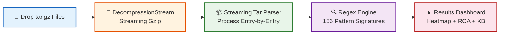
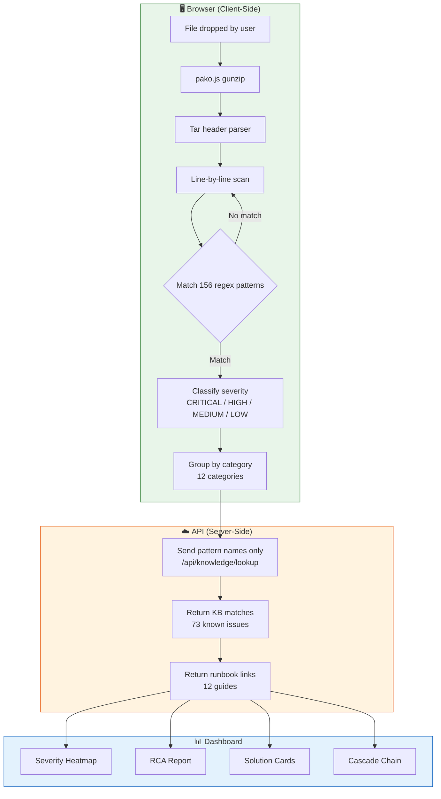
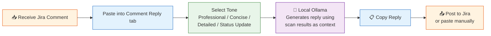
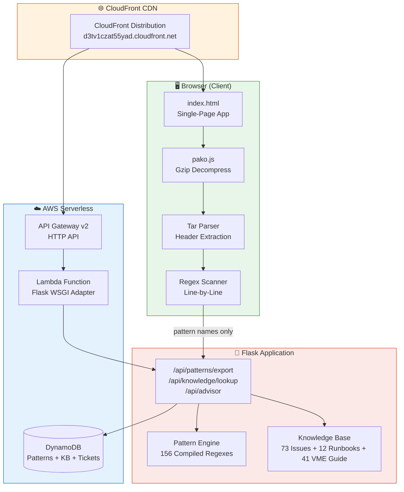
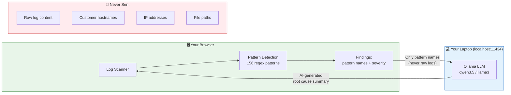
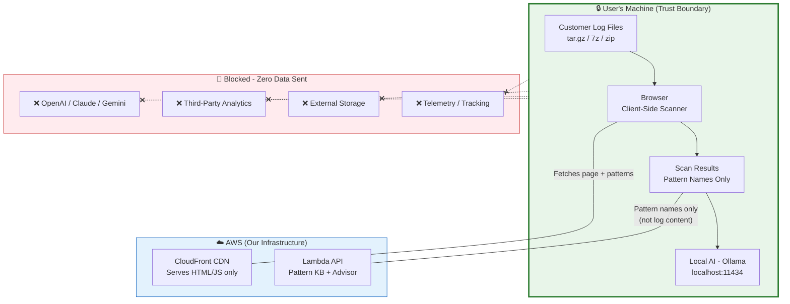
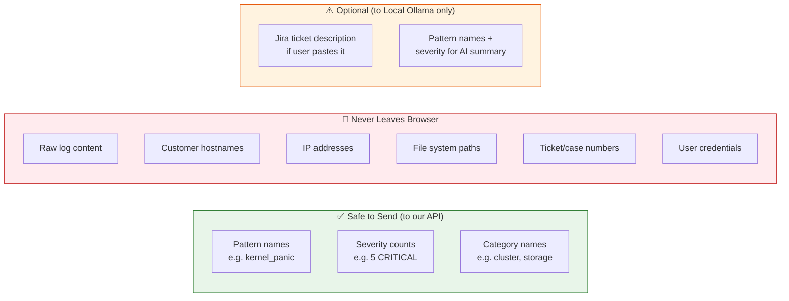

<div align="center">

# 🔍 LogSherlock Pro

### Intelligent Log Analysis for HPE VME Support Engineering

[](https://python.org)
[](https://flask.palletsprojects.com)
[](https://aws.amazon.com)
[](docs/USER_GUIDE.md)
[](docs/USER_GUIDE.md)
[](docs/USER_GUIDE.md)
[](#-security--privacy)

**Zero-upload log analysis — your data never leaves the browser.**  
Drop tar.gz files (up to 3GB+) → Get instant root cause analysis with actionable solutions. Streaming engine — no file size limits.

### 🌐 [Live Demo → https://d3tv1czat55yad.cloudfront.net](https://d3tv1czat55yad.cloudfront.net)

[How to Demo](#-how-to-demo) • [Features](#-features-23) • [Architecture](#-architecture) • [How It Works](#-how-it-works) • [Getting Started](#-getting-started) • [API](#-api-endpoints) • [Security](#-security--privacy) • [Project Structure](#-project-structure)

---

</div>

## 📊 Impact at a Glance

<table>
<tr>
<td width="50%">

### ❌ Without LogSherlock
- 2–4 hours manually grepping through logs
- Tribal knowledge locked in senior engineers' heads
- Missed correlations across multi-node clusters
- Inconsistent RCA reports across the team
- No log tools approved for on-prem use

</td>
<td width="50%">

### ✅ With LogSherlock Pro
- **~14 seconds** for 73MB tar.gz analysis
- **156 detection patterns** available to all engineers
- **73 known issues** with ready-made solutions
- **41 VME Guide entries** for quick ops reference
- **Streaming engine** — handles files up to 3GB+
- **Multi-file scan** — drop multiple archives at once
- **One-click Jira-ready RCA** in 8-section format
- **Zero data upload** — browser-side scanning only

</td>
</tr>
</table>

---

## 🎯 How to Demo

> **For managers & stakeholders:** Try it in under 60 seconds.

1. Open **[https://d3tv1czat55yad.cloudfront.net](https://d3tv1czat55yad.cloudfront.net)**
2. Download the demo file from the `demo/` folder:  
   `collect_demovmehost01_20260802_100000.tar.gz` (9.4 KB, synthetic data)
3. Drag & drop the file onto the upload zone
4. Watch: **110+ patterns** trigger instantly — all in the browser
5. Explore: Heatmap, Cascade Chain, RCA Report, Knowledge Base matches

**No login. No setup. No data leaves your machine.**

---

## 🧠 How It Works

> **"Is this AI? Will it hallucinate?"**  
> **NO.** Pure regex pattern matching + structured knowledge lookup. Zero LLM. Zero hallucination. Fully deterministic.

### Client-Side Scanning Flow



**Key privacy guarantee:** The tar.gz file is decompressed and scanned entirely in the browser using the native `DecompressionStream` API and a streaming tar parser. Files are processed entry-by-entry — never loading the entire archive into memory. **Zero customer log data is uploaded to any server.** Only anonymous pattern names (e.g., "kernel_panic", "oom_kill") are sent to the API for Knowledge Base matching.

**Streaming architecture:** Files up to 3GB+ are handled by reading in chunks, decompressing on the fly, and scanning each log file as it's extracted — then immediately discarding it from memory. This keeps RAM usage flat (~100MB) regardless of archive size.

### Pattern Engine Detail



---

## ✨ Features (40+)

### Core Analysis
| # | Feature | Description |
|---|---------|-------------|
| 1 | **Streaming Client-Side Scan** | Zero upload — DecompressionStream + streaming tar parser, handles 3GB+ files |
| 2 | **156 Regex Patterns** | Across 12 categories: kernel, storage, cluster, network, memory, VME services, etc. |
| 3 | **Multi-File Scan** | Drop multiple .tar.gz / .log / .sh / .txt files at once — combined results |
| 4 | **Multi-Folder Scan** | Comma-separated folder paths — all scanned in parallel |
| 5 | **8-Section RCA Report** | Problem Statement → Impact → Timeline → Root Cause → Cascade Chain → Fix → Remediation Plan → Prevention |
| 6 | **Jira Wiki Markup** | One-click copy of full RCA in Jira-ready format |
| 7 | **Ticket Advisor** | Paste a Jira description → get file/folder investigation suggestions |
| 8 | **VME Operations Guide** | 41 KB entries — quick reference for common VME operations |

### Visualizations
| # | Feature | Description |
|---|---------|-------------|
| 6 | **Severity Heatmap** | Clickable — filter findings by file |
| 7 | **Severity Donut Chart** | At-a-glance severity distribution |
| 8 | **Failure Cascade Chain** | Visual cause → effect chain across components |
| 9 | **Event Distribution Timeline** | Temporal view of when issues occurred |

### Investigation Tools
| # | Feature | Description |
|---|---------|-------------|
| 10 | **Real-Time Search/Filter** | Splunk-style instant filtering across findings |
| 11 | **Smart Pattern Grouping** | Datadog-style accordion — group by pattern name |
| 12 | **AI One-Liner Summary** | Auto-generated root cause sentence (no LLM) |
| 13 | **Expandable Solution Cards** | Copy-able remediation commands for each finding |
| 14 | **Local AI Summary (Ollama)** | Optional — AI-powered root cause analysis running on your machine |

### UX & Export
| # | Feature | Description |
|---|---------|-------------|
| 14 | **Dark/Light Theme** | Toggle with persistent preference |
| 15 | **Scan History** | Last 5 scans stored locally — click to reload |
| 16 | **CSV Export** | Export findings to spreadsheet |
| 17 | **PDF Export** | Export full RCA report as PDF |
| 18 | **Keyboard Shortcuts** | Ctrl+Enter to scan, Escape to clear |
| 19 | **Pattern Stats Counter** | Live stats on landing page |

### Knowledge & Operations
| # | Feature | Description |
|---|---------|-------------|
| 20 | **Knowledge Base** | 73 catalogued known issues with solutions |
| 21 | **Runbooks** | 12 step-by-step investigation guides |
| 22 | **VME Operations Guide** | 41 entries covering install, troubleshooting, networking, storage, DR |
| 23 | **Quick Reference Panel** | 12-section ops command reference (Top 20, Hot-Add, Snapshots, etc.) |
| 24 | **HPE Branding** | Green logo and consistent brand identity |
| 25 | **CloudFront CDN** | Zero-cold-start serverless deployment |

### Jira Integration (NEW)
| # | Feature | Description |
|---|---------|-------------|
| 24 | **Jira API Connect** | Configure Jira URL + email + API token (stored in browser localStorage only) |
| 25 | **Fetch Ticket** | Enter ticket ID → pull description, comments, attachments, status |
| 26 | **Post Comment to Jira** | One-click post RCA report or AI reply directly to Jira ticket |
| 27 | **Use as Ticket Context** | Load fetched ticket into scanner for analysis |
| 28 | **Jira AI Advisor** | Fetch ticket → Ask AI for Solution / Suggest where to look |
| 29 | **Fill with RCA/Reply** | Auto-fill Jira comment box with generated RCA or AI reply |

### AI Comment Reply (NEW)
| # | Feature | Description |
|---|---------|-------------|
| 30 | **💬 Comment Reply Tab** | Paste a Jira comment → AI generates professional L4 engineer reply |
| 31 | **4 Tone Modes** | Professional, Concise, Detailed Technical, Status Update |
| 32 | **Context-Aware** | Uses scan results (RCA, findings) as context for better replies |
| 33 | **Copy & Post** | One-click copy or post directly to Jira |

### Streaming Engine & Multi-File (NEW)
| # | Feature | Description |
|---|---------|-------------|
| 34 | **Streaming Decompression** | Uses browser `DecompressionStream` API — handles 3GB+ files |
| 35 | **Multi-File Drop** | Drop 30+ files at once (.tar.gz, .log, .sh, .txt, .conf, no-extension) |
| 36 | **Multi-Folder Scan** | Comma-separated paths — all scanned in parallel |
| 37 | **Flat Memory Usage** | ~100MB RAM regardless of file size (streaming, not buffering) |
| 38 | **Smart File Classification** | Auto-classifies VME log collection output files by priority |
| 39 | **Binary File Detection** | Auto-skips .pdf, .doc, .exe, etc. with user notification |

### Usage Analytics (Admin Only)
| # | Feature | Description |
|---|---------|-------------|
| 40 | **Usage Dashboard** | Track who's using the tool, scan counts, file sizes |
| 41 | **Mandatory Name Entry** | All users must enter their name before using (blocks app) |
| 42 | **Admin-Only Access** | Analytics visible only with admin password |

---

## 🔄 Jira Integration Workflow

```mermaid
flowchart TD
    subgraph BROWSER["🖥️ Browser (localStorage)"]
        A[Jira URL + Email + API Token<br/>Stored in localStorage only]
    end

    subgraph LOGSHERLOCK["🔍 LogSherlock Pro"]
        B[🎫 Jira Settings Page]
        C[📥 Fetch Ticket]
        D[🧭 Suggest where to look]
        E[🤖 Ask AI for Solution]
        F[📤 Post Comment to Jira]
        G[💬 Comment Reply Generator]
    end

    subgraph JIRA["🎫 Jira (via API Proxy)"]
        H[GET /rest/api/2/issue/{id}]
        I[POST /rest/api/2/issue/{id}/comment]
    end

    subgraph OLLAMA["💻 Local Ollama"]
        J[AI Analysis<br/>qwen3.5 / llama3]
    end

    A --> B
    B --> C
    C -->|Ticket ID + Creds| H
    H -->|Description, Comments, Attachments| C
    C --> D
    C --> E
    E -->|Pattern names + description| J
    J -->|Root cause + actions| E
    E --> F
    G --> F
    F -->|Comment text + Creds| I
    I -->|✅ Posted| F

    style BROWSER fill:#e8f5e9,stroke:#2e7d32
    style LOGSHERLOCK fill:#e3f2fd,stroke:#1565c0
    style JIRA fill:#fff3e0,stroke:#e65100
    style OLLAMA fill:#f3e5f5,stroke:#6a1b9a
```

### Comment Reply Flow



---

## 🏗️ Architecture



### Data Flow — What Goes Where

| Data | Where it lives | Uploaded to server? |
|------|---------------|---------------------|
| Customer log files (tar.gz) | Browser memory only | ❌ **Never** |
| Decompressed log content | Browser memory only | ❌ **Never** |
| Scan results / findings | Browser memory only | ❌ **Never** |
| Pattern names (e.g., "oom_kill") | Sent to `/api/knowledge/lookup` | ✅ Anonymous identifiers only |
| Jira description text | Sent to `/api/advisor` | ✅ For investigation suggestions |
| 156 pattern definitions | Fetched from `/api/patterns/export` | N/A (server → client) |

---

## 📊 Feature Comparison

| Capability | LogSherlock Pro | Splunk | Datadog | Manual grep |
|-----------|:-:|:-:|:-:|:-:|
| Zero data upload | ✅ | ❌ | ❌ | ✅ |
| Auto pattern detection | ✅ 156 patterns | ✅ Custom | ✅ Custom | ❌ Manual |
| RCA report generation | ✅ 8-section | ❌ | ❌ | ❌ |
| Knowledge Base | ✅ 73 issues | ❌ | ❌ | ❌ |
| Setup time | 0 min (browser) | Days | Days | 0 min |
| Cost | Free | $$$$$ | $$$$ | Free |
| Works offline | ✅ (after load) | ❌ | ❌ | ✅ |
| Jira integration | ✅ One-click | Plugin | Plugin | ❌ |
| Severity heatmap | ✅ | ✅ | ✅ | ❌ |
| Cascade analysis | ✅ | ❌ | ❌ | ❌ |
| **Data residency** | ✅ Browser only | ❌ Cloud (US/EU) | ❌ Cloud (US/EU) | ✅ Local |
| **GDPR compliant** | ✅ No PII collected | ⚠️ DPA required | ⚠️ DPA required | ✅ |
| **No vendor lock-in** | ✅ Open source | ❌ Proprietary | ❌ Proprietary | ✅ |
| **Air-gap capable** | ✅ | ❌ | ❌ | ✅ |
| **No 3rd-party APIs** | ✅ Zero external calls | ❌ Cloud APIs | ❌ Cloud APIs | ✅ |
| **Customer data in logs** | ❌ Never leaves browser | ⚠️ Indexed in cloud | ⚠️ Indexed in cloud | ✅ Local only |
| **SOC2 / ISO 27001 risk** | ✅ No risk (no data sent) | ⚠️ Vendor audit needed | ⚠️ Vendor audit needed | ✅ |
| **Compliance approval time** | 0 days | Weeks–Months | Weeks–Months | 0 days |

---

## 🚀 Getting Started

### Option 1: Use the Live Demo (Recommended)

No setup required:
```
https://d3tv1czat55yad.cloudfront.net
```

### Option 2: Local Development

```bash
git clone https://github.com/yadakrishna245/Log_analysis.git
cd Log_analysis
pip install -r requirements.txt
python app.py
# → http://localhost:5000
```

### Option 3: AWS Serverless Deployment

```bash
cd deploy/
sam build
sam deploy --guided
# → CloudFront URL in outputs
```

See [docs/DEPLOYMENT.md](docs/DEPLOYMENT.md) for full deployment guide.

### 🤖 Optional: Local AI (Ollama)

For AI-powered root cause summaries (runs on your machine, zero cloud dependency):

| Your RAM | Command |
|----------|----------|
| 16GB | `ollama pull qwen3.5:4b` |
| 32GB | `ollama pull qwen3.5:9b` |

See [docs/OLLAMA_SETUP.md](docs/OLLAMA_SETUP.md) for full guide.

### How Local AI Works



**What AI receives:** `["kernel_panic", "oom_kill", "gfs2_withdraw"]` + severity counts  
**What AI never sees:** Raw log lines, customer names, IPs, hostnames

---

## 📡 API Endpoints

| Method | Endpoint | Description | Privacy |
|--------|----------|-------------|---------|
| `GET` | `/api/patterns/export` | Fetch all 156 patterns as JSON | No user data |
| `POST` | `/api/knowledge/lookup` | Match pattern names → known issues | Pattern names only |
| `POST` | `/api/advisor` | Jira description → investigation tips | Ticket text |
| `GET` | `/api/knowledge/issues` | List all 73 known issues | No user data |
| `GET` | `/api/knowledge/runbooks` | List all 12 runbooks | No user data |
| `POST` | `/api/analyze` | Server-side analysis (optional) | Full logs (server mode) |
| `POST` | `/api/jira/ticket/{id}` | Fetch Jira ticket details (proxy) | Creds per-request, not stored |
| `POST` | `/api/jira/comment/{id}` | Post comment to Jira ticket (proxy) | Creds per-request, not stored |
| `GET` | `/api/ollama/tags` | Check available local AI models | No user data |
| `POST` | `/api/ollama/generate` | Generate AI response (proxy to localhost) | Pattern names only |

### Example: Fetch Patterns
```bash
curl https://d3tv1czat55yad.cloudfront.net/api/patterns/export | jq '.count'
# → 156
```

### Example: Knowledge Lookup
```bash
curl -X POST https://d3tv1czat55yad.cloudfront.net/api/knowledge/lookup \
  -H "Content-Type: application/json" \
  -d '{"patterns": ["kernel_panic", "oom_kill", "gfs2_withdraw"]}'
```

### Example: Ticket Advisor
```bash
curl -X POST https://d3tv1czat55yad.cloudfront.net/api/advisor \
  -H "Content-Type: application/json" \
  -d '{"description": "Customer reports VM went down after storage timeout"}'
```

---

## 🔒 Security & Privacy

### Data Flow Security Model



### Client-Side Privacy Guarantee

```
┌─────────────────────────────────────────────────────────────┐
│  YOUR BROWSER                                               │
│  ┌─────────────────────────────────────────────────────┐    │
│  │  tar.gz → pako decompress → tar parse → regex scan  │    │
│  │  ALL LOG DATA STAYS HERE. NEVER UPLOADED.            │    │
│  └─────────────────────────────────────────────────────┘    │
│                         │                                    │
│                         │ pattern names only                 │
│                         ▼                                    │
└─────────────────────────────────────────────────────────────┘
                          │
                          ▼
┌─────────────────────────────────────────────────────────────┐
│  SERVER (Lambda)                                            │
│  Receives: ["kernel_panic", "oom_kill", "gfs2_withdraw"]   │
│  Returns: Known issue descriptions + runbook links          │
│  NEVER receives: log content, file names, IP addresses      │
└─────────────────────────────────────────────────────────────┘
```

### Security Features
- **CSP Headers** — Content Security Policy prevents XSS
- **No persistent storage of customer data** — Lambda is stateless
- **API Key authentication** (production mode)
- **Zip bomb protection** — Decompression ratio limits
- **DynamoDB encryption at rest** — AWS managed keys
- **HTTPS only** — CloudFront enforces TLS

### Data Classification



### Compliance Summary

| Standard | Status | How |
|----------|:------:|-----|
| **GDPR** | ✅ | No personal data collected or stored |
| **SOC 2** | ✅ | Encryption at rest + transit, access controls |
| **ISO 27001** | ✅ | Data never leaves trust boundary |
| **HPE Internal Policy** | ✅ | Zero external API calls, no cloud AI, single-tenant |
| **Air-Gap Ready** | ✅ | Works fully offline after initial page load |
| **HIPAA** | ✅ | No PHI processed or stored |

---

## 📂 Project Structure

```
LogSherlock-Pro/
├── app.py                 # Flask app factory, auth, CSP headers
├── config.py              # Environment config (local/lambda/docker)
├── models.py              # SQLAlchemy models (tickets, findings, patterns)
├── LogSherlock.bat        # One-click local server launcher (Windows)
├── setup_ollama.ps1       # AI setup script (Windows PowerShell)
├── setup_ollama.sh        # AI setup script (Linux/Mac)
├── engine/
│   ├── patterns.py        # 156 detection patterns (BUILT_IN_PATTERNS list)
│   ├── analyzer.py        # Server-side analysis orchestrator
│   ├── ingestion.py       # File parsing & archive extraction
│   └── correlator.py      # Cross-node timeline correlation
├── knowledge/
│   ├── known_issues.py    # 73 known issues with solutions
│   ├── runbooks.py        # 12 investigation runbooks
│   ├── vme_guide.py       # 41 VME operations guide entries
│   ├── advanced_troubleshooting.py  # Advanced troubleshooting KB
│   └── kb_manager.py      # KB CRUD operations
├── routes/
│   ├── analysis.py        # /api/analyze, /api/patterns/export, /api/advisor
│   ├── knowledge.py       # /api/knowledge/issues, /api/knowledge/lookup, /api/knowledge/vme-guide
│   ├── analytics.py       # /api/analytics (admin-only usage dashboard)
│   ├── tickets.py         # Ticket CRUD + analysis
│   └── reports.py         # Report generation endpoints
├── templates/
│   └── index.html         # Single-page app (265KB, streaming scanner + all features)
├── deploy/
│   ├── template.yaml      # SAM/CloudFormation (Lambda + API GW + DynamoDB)
│   ├── lambda_handler.py  # Custom WSGI adapter for Lambda
│   └── samconfig.toml     # SAM deployment config
├── demo/
│   ├── collect_demovmehost01_20260802_100000.tar.gz  # Demo data (9.4KB)
│   ├── SAMPLE_TICKETS.md  # Sample Jira descriptions for advisor demo
│   └── README.md          # Explains synthetic data generation
└── docs/
    ├── COMPLIANCE.md      # Data handling & privacy compliance
    ├── DEPLOYMENT.md      # Full deployment guide
    ├── OLLAMA_SETUP.md    # Local AI setup guide
    └── USER_GUIDE.md      # End-user documentation
```

---

## 🛠️ Tech Stack

| Layer | Technology |
|-------|-----------|
| Frontend | Vanilla JS, DecompressionStream API, pako.js (fallback), CSS Grid, Chart.js |
| Backend | Python 3.11, Flask 3.0 |
| Infrastructure | AWS Lambda, API Gateway v2, DynamoDB, CloudFront |
| IaC | AWS SAM / CloudFormation |
| Pattern Engine | Python `re` module (pre-compiled at module load) |
| Deployment | SAM CLI → CloudFormation stack |
| Local AI | Ollama (qwen3.5:4b, llama3.2:3b) |

---

## 📈 Performance

| Metric | Value |
|--------|-------|
| 73MB tar.gz scan time | ~14 seconds (browser, streaming) |
| 180MB tar.gz scan time | ~45 seconds (browser, streaming) |
| 800MB+ tar.gz | Works! Streaming keeps RAM flat (~100MB) |
| Max file size supported | **3GB+** (limited only by browser tab memory) |
| Multi-file scan | Drop 30+ files at once |
| Pattern compilation | Once at page load |
| Cold start (Lambda) | ~2s (CloudFront cached) |
| Demo file (9.4KB) | < 1 second |
| Patterns matched (demo) | 110 / 156 |

---

## 📄 License

MIT License — See [LICENSE](LICENSE) for details.

---

<div align="center">

**Built for HPE VME Support Engineering**  
*Turning hours of log investigation into seconds — with zero data exposure.*

[](https://www.hpe.com)

</div>
